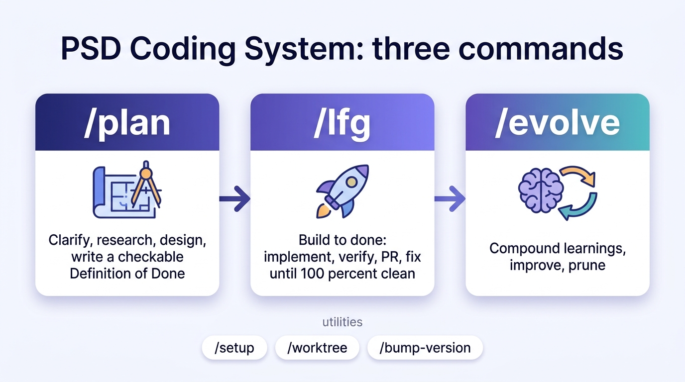

# PSD Coding System

**Comprehensive AI-assisted development system for Peninsula School District**

Version: 3.3.3
Status: Production-Ready Workflows + Memory-Based Learning
Author: Kris Hagel (hagelk@psd401.net)

---

## What Is This?

A unified Claude Code plugin that collapses development into a tight, contract-driven loop: **plan → build-to-done → compound what you learned**. The v3.0.0 overhaul consolidates 21 skills down to **6**, replaces "the agent thinks it's finished" with a **machine-checkable Definition of Done**, and makes "done" mean "the verify gate is green and the PR is 100% reviewed."

**One plugin. Three superpowers.**

1. **Workflow Automation** — 6 skills + 44 specialized agents
2. **Verifiable Done** — a per-project Definition-of-Done gate that `/lfg` loops against and a Stop hook that refuses to finish while it's red
3. **Knowledge Evolution** — `/lfg` captures and commits learnings; `/evolve` compounds them into durable docs/agents, then prunes them

> 🖼️ **New here? Start with the [visual How-to-Use guide](docs/how-to-use.md)** — infographics for the three commands, the `/lfg` loop, the Definition-of-Done gate, parallel worktrees, and the cloud routines.



---

## Quick Start

```bash
# Install the marketplace
/plugin marketplace add psd401/psd-claude-plugins

# Install this plugin
/plugin install psd-coding-system

# Configure the verification gate for this repo (one-time)
/setup

# Plan, then build to done
/plan "add response caching to the search endpoint"
/lfg 347               # Implement issue 347 → verify → PR → fix every review round
/evolve                # Compound accumulated learnings into the plugin
```

---

## Workflow Commands

Six skills, each with a clear lane. The old 21 skills were absorbed — `/plan` swallows the design surface, `/lfg` swallows the build/test/review surface, and `/bump-version` swallows `/changelog`.

| Command | Description | Example |
|---------|-------------|---------|
| `/plan` | Clarify → parallel research → design → emit a task breakdown + a machine-checkable Definition of Done (and optionally contract-compliant GitHub issues). Absorbs architect, brainstorm, scope, product-manager, deepen-plan, issue. | `/plan 347` or `/plan "add caching"` |
| `/lfg` | Autonomous build-to-done: implement → verify-loop (build, zero-warning lint, typecheck, full test suite, Playwright E2E + screenshots) until green → open a PR with embedded screenshots → watch CI + the project's AI reviewers and fix every round until APPROVED and all checks pass. Commits learnings. Absorbs work, test, debug, optimize, review-pr, security-audit. | `/lfg 347` or `/lfg "fix login redirect"` |
| `/evolve` | Compound learnings into CLAUDE.md / patterns / agents then prune them; release tracking; competitor compare. | `/evolve` |
| `/setup` | Write `.psd/verify.json` — the per-project verify gate (commands, E2E flows, strictness, AI-reviewer logins, commit_learnings, active review agents). | `/setup` / `/setup show` / `/setup reset` |
| `/worktree` | Git worktree management + multi-window parallel how-to + `/worktree clean` post-merge hygiene (prune worktrees, delete merged local/remote branches, close orphaned issues). | `/worktree 347` · `/worktree clean` |
| `/bump-version` | The version-bump ritual across three independent tracks (absorbs `/changelog`). | `/bump-version minor` |

> **Removed in v3.0.0:** `/work`, `/test`, `/debug`, `/optimize`, `/review-pr`, `/security-audit`, `/architect`, `/brainstorm`, `/scope`, `/product-manager`, `/deepen-plan`, `/issue`, `/changelog`, `/clean-branch`, `/swarm`, `/triage`. Their behavior is folded into the six skills above. (FreshService-ticket intake now lives only in the cloud `triage` routine, not as a local skill.)

---

## The Definition-of-Done Gate

The core of the overhaul. "Done" is no longer a judgment call — it's a contract the machine checks.

| Piece | What it is |
|-------|-----------|
| `.psd/verify.json` | Per-project config written by `/setup`: build/lint/typecheck/test/e2e commands, named E2E flows, strictness, AI-reviewer logins, `commit_learnings`, and which review agents are active. Committed to git so the whole team shares it. |
| `scripts/verify-gate.sh` | Runs the configured gate commands and writes the result to `.psd/last-gate-result`. If `.psd/verify.json` is absent the gate is **inert** — the plugin never disrupts a repo that hasn't opted in. |
| `scripts/verify-gate-stop-hook.sh` | A **Stop hook** that blocks the session from finishing until the gate is verifiably green at the current commit with a clean tree (when `strictness: block`). |
| `runtime-verifier` agent | The only agent that **executes** the app — runs build, zero-warning lint, typecheck, the full test suite, and Playwright E2E, and captures screenshots. Every other reviewer reads code; this one runs it. |
| `docs/patterns/definition-of-done.md` | The canonical DoD spec the gate maps to. |
| `docs/patterns/issue-contract.md` | The shape every issue must have so `/lfg` can drive it with no human translation step — the `<!-- dod:start -->…<!-- dod:end -->` block is the loop exit condition. |
| `docs/patterns/worktrees-explained.md` | Mental model + recipe for running several `/lfg` sessions in parallel. |

The canonical DoD (web/app project): build succeeds, **zero lint warnings** (no suppressions), typecheck clean, **full** test suite green (whole app, not touched files), configured E2E flows green, and visual evidence captured and attached to the PR.

---

## AI Agents (44 total)

### Review Specialists (15) — `agents/review/`

| Agent | Purpose |
|-------|---------|
| `security-reviewer` | Security vulnerability analysis + code review (OWASP, secrets, authz) — merged the two prior security agents in v3.0.0 |
| `deployment-verification-agent` | Go/No-Go deployment checklists |
| `data-migration-expert` | ID mappings, foreign key validation |
| `agent-native-reviewer` | AI architecture parity checks |
| `architecture-strategist` | SOLID compliance, anti-pattern detection |
| `code-simplicity-reviewer` | YAGNI enforcement, complexity scoring |
| `pattern-recognition-specialist` | Code duplication detection |
| `correctness-reviewer` | Logic errors, edge cases, off-by-one, state bugs |
| `adversarial-reviewer` | Failure scenarios across component boundaries |
| `schema-drift-detector` | ORM vs migration schema drift detection |
| `data-integrity-guardian` | PII/FERPA/GDPR compliance scanning |
| `typescript-reviewer` | TypeScript/JavaScript code review |
| `python-reviewer` | Python code review |
| `swift-reviewer` | Swift code review |
| `sql-reviewer` | SQL code review |

### Domain Specialists (7) — `agents/domain/`

| Agent | Purpose |
|-------|---------|
| `backend-specialist` | APIs, server logic, system integration |
| `frontend-specialist` | React, UI components, UX |
| `database-specialist` | Schema design, query optimization |
| `llm-specialist` | AI integration, prompt engineering |
| `ux-specialist` | usability heuristics, accessibility |
| `architect-specialist` | Architecture design |
| `shell-devops-specialist` | Shell scripting, DevOps |

### Quality Assurance (4) — `agents/quality/`

| Agent | Purpose |
|-------|---------|
| `runtime-verifier` | **The only agent that runs the app** — executes the full DoD gate (build/lint/typecheck/full suite/Playwright) and captures screenshots; returns PASS/FAIL with failing steps + evidence paths. Added in v3.0.0. |
| `test-specialist` | Test coverage, automation, QA |
| `performance-optimizer` | Web vitals, API latency, Big O analysis, N+1 detection |
| `documentation-writer` | API docs, user guides |

### Research (6) — `agents/research/`

| Agent | Purpose |
|-------|---------|
| `learnings-researcher` | Knowledge base search |
| `spec-flow-analyzer` | Gap analysis, user flow mapping |
| `best-practices-researcher` | Two-phase knowledge lookup with deprecation validation |
| `framework-docs-researcher` | Framework/API deprecation checking |
| `git-history-analyzer` | Git archaeology, hot files, churn patterns |
| `repo-research-analyst` | Codebase onboarding and deep research |

### Workflow (4) — `agents/workflow/`

| Agent | Purpose |
|-------|---------|
| `work-researcher` | Pre-implementation research orchestrator |
| `work-validator` | Post-implementation validation orchestrator |
| `bug-reproduction-validator` | Documented bug reproduction with evidence |
| `learning-writer` | Automatic learning capture and deduplication |

### External AI (2) — `agents/external/`

| Agent | Purpose |
|-------|---------|
| `gpt-5-codex` | GPT-5.3-Codex for second opinions (registers as `external:gpt-5`) |
| `gemini-3-pro` | Gemini 3.1 Pro for multimodal analysis |

### Meta (1) — `agents/meta/`

| Agent | Purpose |
|-------|---------|
| `meta-reviewer` | Analyzes learnings + agent memory for patterns |

### Validators (5) — `agents/validation/`

| Agent | Purpose |
|-------|---------|
| `plan-validator` | Plan validation and iteration |
| `document-validator` | Data validation at boundaries |
| `configuration-validator` | Multi-file consistency |
| `breaking-change-validator` | Dependency analysis before deletions |
| `telemetry-data-specialist` | Data pipeline correctness |

**Skill → agent dispatch:** see [`docs/agent-manifest.md`](docs/agent-manifest.md) for the full map of which skill (or orchestrator) invokes each agent and when.

---

## Knowledge Compounding System

### How It Works

```
┌─────────────────────────────────────────────────────────────────┐
│                  CAPTURE → COMMIT → COMPOUND → PRUNE             │
├─────────────────────────────────────────────────────────────────┤
│                                                                 │
│  /lfg run                AI Synthesis                           │
│  ┌───────────────────┐  ┌───────────────────┐                  │
│  │ Errors hit        │  │ learning-writer   │                  │
│  │ Review findings   │  │ - Capture         │                  │
│  │ Fixes applied     │──▶ - Deduplicate     │                  │
│  │ Discoveries       │  │ - Commit to repo  │                  │
│  └───────────────────┘  └─────────┬─────────┘                  │
│                                   │                             │
│                                   ▼                             │
│  ┌───────────────────────────────────────────────────────────┐ │
│  │   docs/learnings/   ──/evolve──▶  CLAUDE.md / patterns /   │ │
│  │   (raw learnings)    compound     agents  (durable)       │ │
│  │                      then prune   ← source files deleted  │ │
│  └───────────────────────────────────────────────────────────┘ │
│                                                                 │
└─────────────────────────────────────────────────────────────────┘
```

### Capturing Learnings

Learnings are captured **and committed** by `/lfg` via the `learning-writer` agent at the end of every run (commit gated by `commit_learnings` in `.psd/verify.json`, default true). There is no separate `/test`/`/review-pr`/`/debug` capture step anymore — it all flows through `/lfg`.

### Compounding & Pruning

```bash
/evolve
```

When ≥8 unanalyzed learnings accumulate, `/evolve` dispatches the `meta-reviewer` agent to fold the recurring insights into durable homes (CLAUDE.md, `docs/patterns/`, agent definitions) and then **prunes** the source learning files it compounded — so the pile shrinks instead of growing. `/evolve` auto-picks the highest-value action from a priority list: deep pattern analysis → Claude Code release-gap check → universal-pattern contribution → competitor comparison (Every's Compound Engineering plugin) → automation-concept extraction → health dashboard.

### Learning Document Format

```yaml
---
title: Short descriptive title
category: build-errors | test-failures | runtime-errors | performance | security | database | ui | integration | logic
tags: [framework, feature, pattern]
severity: critical | high | medium | low
date: YYYY-MM-DD
applicable_to: project | universal
---

## Summary
Brief description of what was learned.

## Problem
What went wrong or what was discovered.

## Solution
How it was resolved or what the insight means.

## Prevention
How to avoid this in the future.
```

### Sharing Universal Patterns

`/evolve` automatically detects universal learnings ready for contribution and offers to create a PR to the plugin repository.

---

## Language-Specific Reviews

`/lfg`'s self-review phase detects the changed-file extensions and dispatches the matching reviewer.

### Detection

Using `scripts/language-detector.sh`:

```bash
./scripts/language-detector.sh
# Output: typescript python sql migration
```

### Supported Languages

| Language | Extensions | Focus Areas |
|----------|------------|-------------|
| TypeScript | `.ts`, `.tsx`, `.js`, `.jsx` | Types, null safety, async patterns, React |
| Python | `.py` | Type hints, async, security, imports |
| Swift | `.swift` | Optionals, memory, SwiftUI, concurrency |
| SQL | `.sql`, `*migration*` | Injection, performance, constraints |

---

## How `/plan` Works

The single planning surface — it scales from a one-line fix to a multi-surface system, but always emits the same shape: a task breakdown plus a machine-checkable Definition of Done.

| Phase | Description |
|-------|-------------|
| 1 | **Clarify** — surface the unknowns; ask the sharp senior-engineer questions until a testable DoD could be written without guessing |
| 2 | **Size it** — Small (tight DoD + short task list) / Medium (research + design + DoD) / Large (architecture + short PRD, decomposed into several issues) |
| 3 | **Research (parallel)** — learnings-researcher, repo-research-analyst, best-practices/framework-docs-researcher, spec-flow-analyzer, architect-specialist (large only) |
| 4 | **Design + write the DoD** — one recommended approach, bite-sized tasks with file paths, binary DoD items mapping to the gate, named E2E flows, out-of-scope/risks/rollback |
| 5 | **Emit** — file contract-compliant GitHub issue(s) (with the mandatory `dod` block, labeled `lfg-ready`) or hand off to `/lfg` immediately |

Optionally pressure-tested by the `plan-validator` agent before emitting.

---

## How `/lfg` Works

Autonomous build-to-done. It does **not** stop at "ready for review" — it stops when the PR is 100% clean.

| Phase | Description |
|-------|-------------|
| 1 | Determine work type + **load the Definition of Done** (from the issue's `dod` block or generated from `definition-of-done.md` + `.psd/verify.json`) — this is the loop exit condition |
| 2 | Create branch — **auto-isolated git worktree per issue** (base = `dev` or default; skipped if already in a worktree or `auto_worktree: false`) |
| 3 | Research via `work-researcher` (knowledge, codebase, git history, test/security/UX context) |
| 4 | Implement (TDD where practical, atomic commits). Bug path: reproduce → root cause → fix the cause → regression test |
| 5 | **Verify-loop** — dispatch `runtime-verifier` to run the full gate + Playwright; fix→verify until GREEN (no `\|\| true`, whole app) |
| 6 | **Self-review** — run the configured review agents in parallel; fix all P1/P2/P3 findings, then re-verify |
| 7 | **Open PR with visual evidence** — commit screenshots so they render on the GitHub PR page; no empty checkboxes |
| 8 | **Watch-until-clean (cap 10 rounds)** — wait for CI + the AI reviewers (self-paced ~3-min polls), fix every actionable finding and failing check each round until `reviewDecision == APPROVED` and all checks pass; escalate via AskUserQuestion if still not clean after 10 |
| 9 | **Finalize** — refresh the gate, capture + commit learnings, arm the Stop-hook finalize check |

**Anti-deferral mandate:** fix everything now — no TODOs, no follow-up issues, no `eslint-disable` / `# noqa` / `@ts-ignore`. The only exception is a fix genuinely blocked by an external constraint, in which case `/lfg` stops and asks.

---

## Hooks

| Hook | Event | What It Does |
|------|-------|--------------|
| `verify-gate-stop-hook.sh` | Stop | Blocks finishing until the DoD gate is verifiably green at the current commit with a clean tree (when `strictness: block`) |
| `post-edit-validate.sh` | PostToolUse (Edit/Write) | Fast single-file syntax check for `.py` (py_compile) and `.json` (jq) — fires only for those extensions. No `.ts/.tsx` typecheck (dropped in v3.3.1, issue #77): the full-project `tsc` is redundant with the DoD gate |
| `redact-secrets.sh` | PostToolUse (Bash) | Redacts API keys, tokens, and secrets from Bash output before Claude sees it (`outputReplace`) |
| `pre-compact-context.sh` | PreCompact | Preserves branch, uncommitted changes, recent commits, and active issue across context compaction |
| Worktree hooks | WorktreeCreate / WorktreeRemove | Auto-symlinks `.env` into new worktrees; logs cleanup on removal |

Hooks are non-blocking (except the Stop gate) with short timeouts; they exit cleanly for unknown file types.

---

## Typical Usage Flow

### One-time per repo

```bash
/setup                 # write .psd/verify.json (gate commands, E2E flows, reviewers)
```

### Per feature

```bash
/plan "add response caching"   # → DoD + task breakdown (+ optional lfg-ready issue)
/lfg 347                       # → implement, verify, PR, fix every review round to APPROVED
```

### Parallel work

Open several Claude windows in the repo root and run `/lfg` in each — by default each auto-isolates into its own git worktree:

```bash
# window 1:  claude → /lfg 347
# window 2:  claude → /lfg 350     # its own worktree, in parallel, no collision
```

Opt out per repo with `auto_worktree: false` in `.psd/verify.json` (then isolate manually with `/worktree`).

### Ongoing

```bash
/evolve                # compound + prune learnings; check releases; compare competition
/bump-version minor    # version-bump ritual across the three tracks
```

---

## Installation

### From GitHub

```bash
/plugin marketplace add psd401/psd-claude-plugins
/plugin install psd-coding-system
```

### Verify

```bash
/plugin list
# Should show: psd-coding-system (v3.0.0)
```

### Configure the gate

```bash
/setup           # auto-detects build/lint/test commands and PR reviewers, then writes .psd/verify.json
/setup show      # view current config
/setup reset     # remove it (returns the gate to inert)
```

---

## Troubleshooting

### Commands Not Working

```bash
/plugin uninstall psd-coding-system
/plugin install psd-coding-system
```

### Plugin Not Found

```bash
cd ~/.claude/plugins/marketplaces/psd-claude-plugins
git pull origin main
/plugin install psd-coding-system
```

### The Stop hook won't let me finish

The DoD gate is red, or `.psd/verify.json` is misconfigured. Run the gate yourself (`scripts/verify-gate.sh`) or `/setup show` to inspect. Set `strictness: warn` while adopting the gate in a repo with pre-existing failures, or `/setup reset` to make the gate inert.

---

## Privacy & Security

- Project learnings stored in `docs/learnings/` (local until `/lfg` commits them per `commit_learnings`; auto-pruned by `/evolve` once compounded, and TTL-cleaned after 90 days)
- Agent memory stored locally by Claude Code in `.claude/agent-memory/`
- No telemetry collection
- PostToolUse hooks run automatically (syntax validation + Bash-output secret redaction)
- Stop hook only reads the local gate result — no data collection, no external network requests

---

## Compound Engineering Principles

Every interaction creates improvement opportunities:

- Every bug → regression test + prevention learning
- Every manual process → automation candidate
- Every solution → template for similar problems
- Every learning → compounded into a durable doc/agent, then pruned

Use `/evolve` to analyze, compound, and improve.

---

## Support

- **Issues**: https://github.com/psd401/psd-claude-plugins/issues
- **Email**: hagelk@psd401.net

---

## License

MIT License - Peninsula School District
