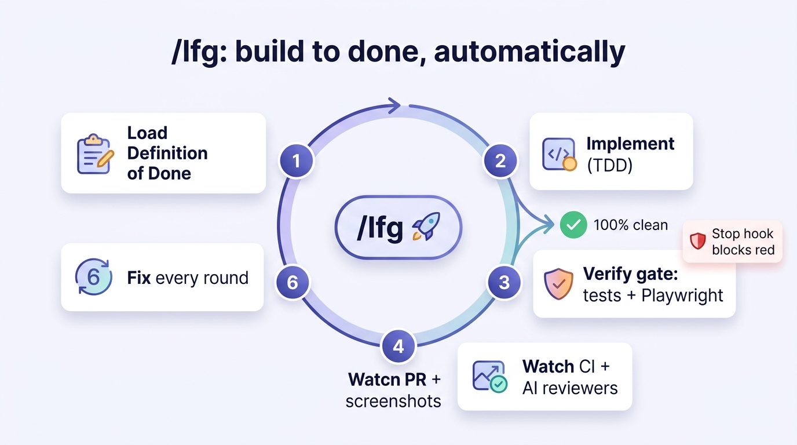
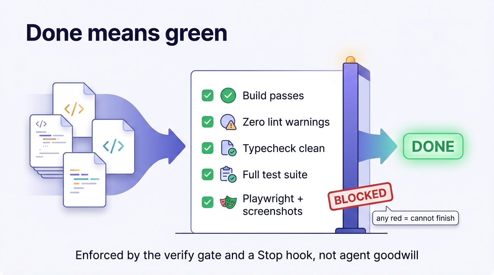
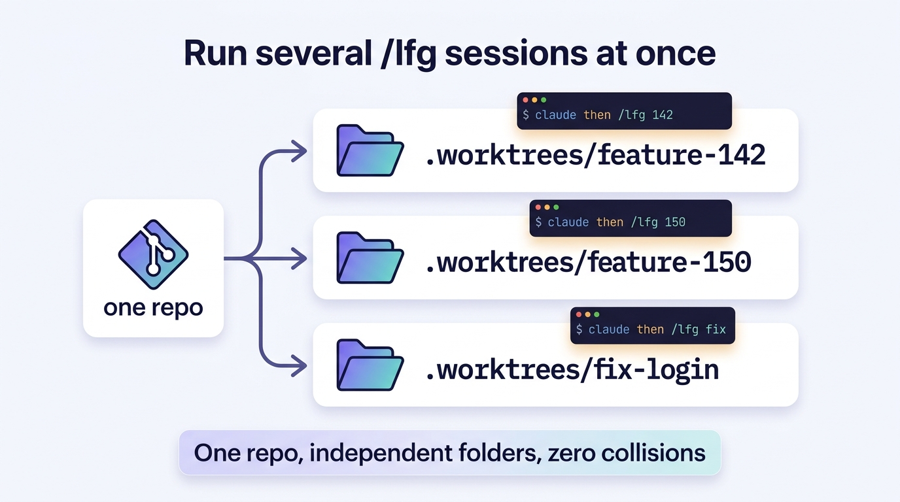
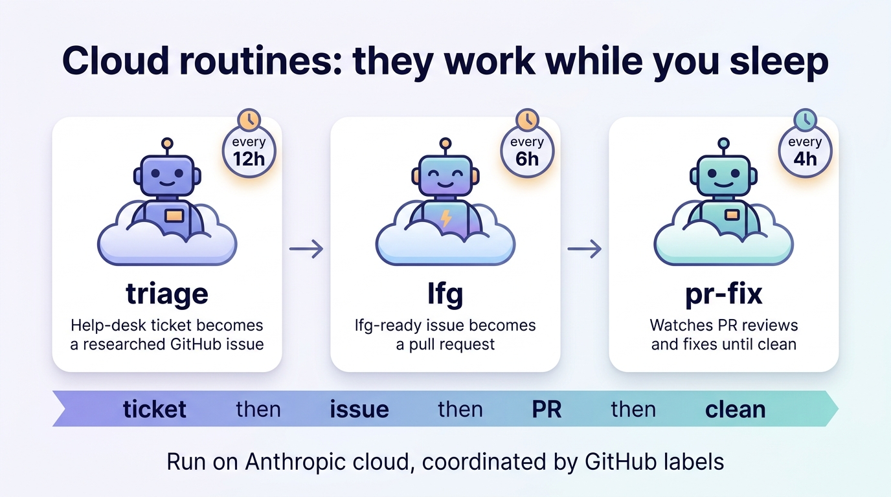

# How to use the PSD Coding System

A visual, plain-English guide to the v3.x workflow. For the full reference, see the [README](../README.md); for the contracts, see [`definition-of-done.md`](patterns/definition-of-done.md), [`issue-contract.md`](patterns/issue-contract.md), and [`worktrees-explained.md`](patterns/worktrees-explained.md).

## The whole thing in one picture: three commands


You only need to learn **three** commands. Everything the old 21 skills did is folded into these:

| Command | What it does | When you reach for it |
|---------|--------------|-----------------------|
| **`/plan`** | Clarifies the idea, researches in parallel, designs the approach, and writes a machine-checkable **Definition of Done** — optionally filing GitHub issues `/lfg` can pick up. | Start of anything non-trivial, or when you want a feature scoped before building. |
| **`/lfg`** | Builds it to done: implement → verify → open a PR with screenshots → watch CI and the AI reviewers and fix every round **until 100% clean**. | When you want something built and shipped to a clean PR. |
| **`/evolve`** | Compounds what was learned into CLAUDE.md / patterns / agents, then prunes the notes. Tracks releases and compares against other tools. | Every so often — it makes the plugin smarter over time. |

Plus three thin utilities: **`/setup`** (configure the verify gate per repo, once), **`/worktree`** (parallel sessions), **`/bump-version`** (release ritual).

## The daily flow

```bash
# One time per repo
/setup                       # writes .psd/verify.json — your verify gate

# Per feature
/plan "add response caching to the search endpoint"
/lfg 347                     # implement issue 347 → verify → PR → fix every review round
/evolve                      # occasionally: bank the learnings
```

## What `/lfg` actually does



`/lfg` does not stop at "ready for review." It loops until the work is genuinely finished:

1. **Loads the Definition of Done** (from the issue, or generates one).
2. **Implements** the change test-first, committing as it goes.
3. **Verify-loop** — runs the gate (build, zero-warning lint, typecheck, the **full** test suite, Playwright + screenshots) and fixes anything red, repeating until green.
4. **Opens a PR** with the screenshots embedded so you can see the feature working.
5. **Watches** CI and the project's AI reviewers.
6. **Fixes every finding**, pushes, re-checks — round after round until `reviewDecision = APPROVED` and all checks pass.

If it gets stuck after several rounds it asks you rather than shipping something red.

## "Done" now means *verifiably* green



The biggest change: an agent can no longer *declare* itself finished. A change is done only when the gate is green — **build passes, zero lint warnings, typecheck clean, the full test suite passes, and Playwright exercises the configured flows with screenshots captured**. A `Stop` hook (configured by `/setup`) refuses to let the session finish while the gate is red, so nothing slips through on goodwill. The gate is **inert** in repos that haven't run `/setup`, so it never disrupts an unrelated project.

## Running several `/lfg` sessions at once (worktrees)



A **git worktree** is a second working folder for the *same* repo, on its own branch — one worktree = one folder = one Claude window, with zero collisions.

**The easy way — it's automatic.** Just open several Claude windows in the repo root and run `/lfg` in each:

```bash
# window 1
claude
/lfg 142      # auto-creates + enters .claude/worktrees/feature-142, isolated

# window 2 (separate terminal)
claude
/lfg 150      # its own worktree, in parallel — no collision with window 1
```

`/lfg` auto-isolates each issue into its own worktree (base = `dev` or the default branch), installs that worktree's dependencies, builds to a clean PR, and you merge normally. Opt out per repo with `auto_worktree: false` in `.psd/verify.json`.

**Manual control** (when you want it): `/worktree 142` to create the folder, then `cd .worktrees/feature-142 && claude && /lfg 142`. Full mental model + pitfalls: [`worktrees-explained.md`](patterns/worktrees-explained.md).

## Hands-off: the cloud routines



Three routines run on Anthropic's servers on a schedule — no open laptop needed. You steer them with **GitHub labels**:

| Routine | Cadence | What it does | You control it by… |
|---------|---------|--------------|--------------------|
| **triage** | ~12h | Turns a help-desk (FreshService) ticket into a researched, contract-compliant GitHub issue. | nothing — it just files issues |
| **lfg** | ~6h | Picks up issues you label `lfg-ready`, builds them, opens a PR. | adding `lfg-ready` (or `lfg-skip` to opt out) |
| **pr-fix** | ~4h | Watches open PRs and fixes review comments / failing CI until clean. | `pr-fix-skip` to opt a PR out |

They never merge PRs and never edit protected files (`.claude/`, hooks, workflows) — those always come back to a human. Setup is documented in [`docs/routines/GETTING-STARTED.md`](../../../docs/routines/GETTING-STARTED.md). **Note:** routine *prompts* are pasted into claude.ai/code/routines, so they don't auto-update from the repo — re-paste them after changing a routine prompt (the agents/skills they use *do* update automatically).

## Quick reference: which command when

| You want to… | Use |
|--------------|-----|
| Scope a feature / write testable acceptance criteria | `/plan` |
| Build a GitHub issue end-to-end and ship a clean PR | `/lfg <issue#>` |
| Make a quick fix and ship it | `/lfg "fix the login redirect"` |
| Configure the verify gate for a repo (first time) | `/setup` |
| Work on several issues at once | `/worktree` + a Claude window each |
| Bank learnings / improve the plugin | `/evolve` |
| Cut a release | `/bump-version` |
